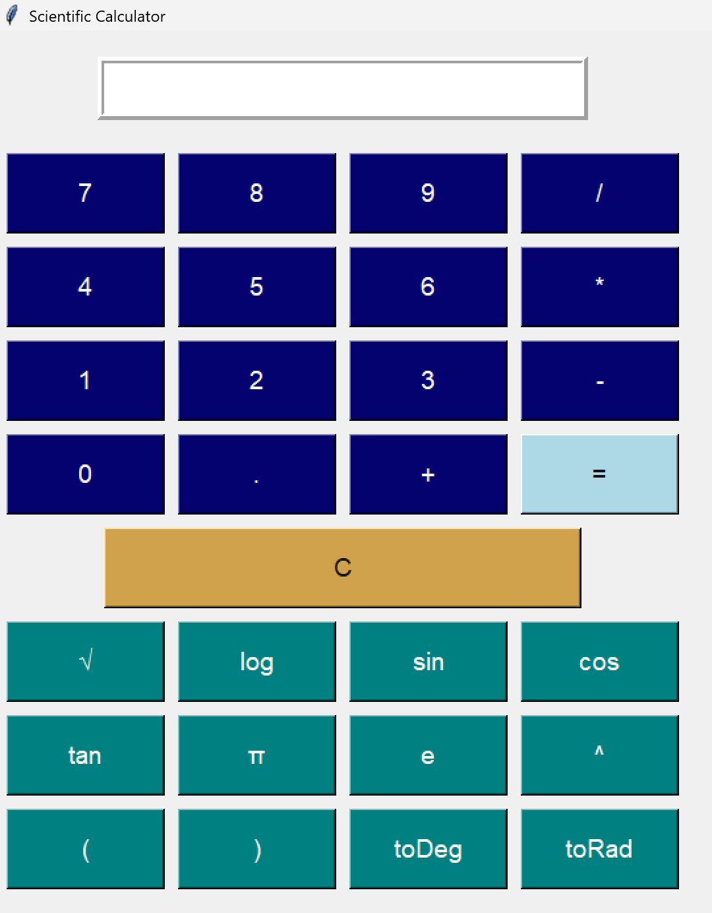

# Scientific Calculator 

This is a simple GUI-based Scientific Calculator built using **Python** and **Tkinter** as part of my **#100DaysOfCode Challenge (Day 1)**.

## Features

- ✅ Basic arithmetic operations: `+`, `-`, `*`, `/`
- ✅ Scientific functions: `sin`, `cos`, `tan`, `log`, `sqrt`, etc.
- ✅ Constants: `π (pi)`, `e`
- ✅ Radian ↔ Degree conversion (`toDeg()`, `toRad()`)

## Screenshot

## 🛠️ How to Run

1. Clone this repo:
<pre>
   git clone https://github.com/Mounil2005s/scientific-calculator.git
</pre>
