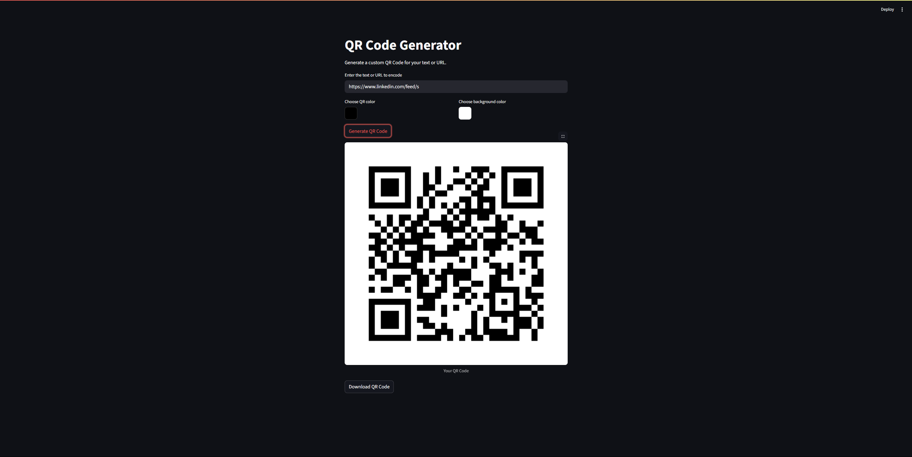

# 📦 Day 11 – QR Code Generator App (100 Days of Code)

This is a simple QR Code Generator built with **Python** and **Streamlit** as part of my #100DaysOfCode challenge.

## 🚀 Features

- ✅ Generate QR codes from any text or URL
- ✅ Download the QR code image
- ✅ Clean and responsive UI using Streamlit
- ✅ No sign-up or login needed

## 🛠️ Tech Stack

- **Python**
- **Streamlit**
- **qrcode** (Python library for generating QR images)
- **PIL (Pillow)** for image handling

## 📸 Demo

  
*Example of QR code generation from user input*

