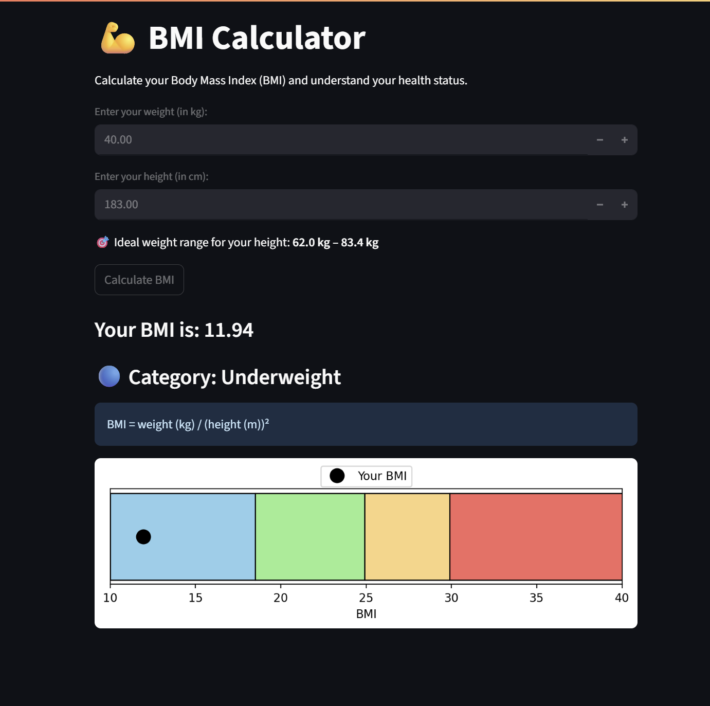

# 🧮 BMI Calculator | Day 14 of #100DaysOfCode

A simple and interactive **BMI (Body Mass Index) Calculator** built using **Streamlit**.  
It helps users calculate their BMI based on their height and weight, and displays a **visual bar** showing where they fall on the standard BMI scale.

---

## 🚀 Features

- ✅ Real-time BMI calculation
- ✅ Category interpretation (Underweight, Normal, Overweight, Obese)
- ✅ Clean, beginner-friendly Streamlit UI
- ✅ Color-coded bar showing ideal BMI range (18.5 - 24.9)
- ✅ Responsive and easy to use

---

## 📸 Screenshot

---
