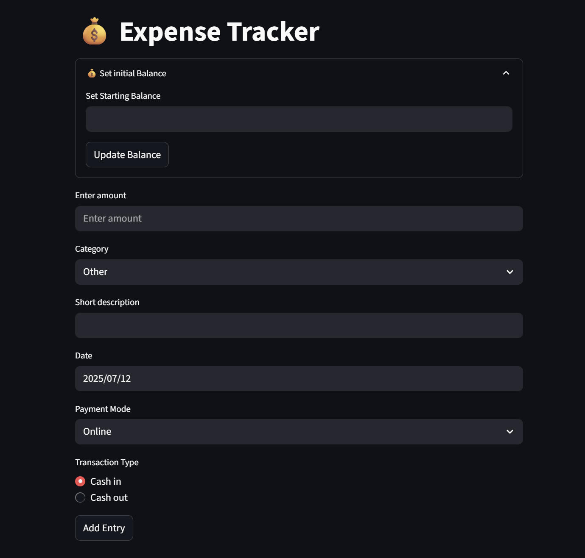

# 💸 Expense Tracker - Day 6 of #100DaysOfCode

A lightweight, browser-based **Expense Tracker App** built using **Streamlit**. It allows users to log daily financial transactions, monitor spending habits, and export records — all with a clean and interactive interface.

## 🚀 Features

- ✅ Set an **initial balance**
- ➕ Log **Cash In** and **Cash Out** transactions
- 💳 Select **Payment Mode** (Online / Cash)
- 🏷️ Add **category**, **description**, and **date**
- 📊 **Monthly summary** by category
- 💼 **Current balance** tracking
- ⬇️ Export data as a **CSV**
- 🧠 Error handling and input validation

## 📷 Screenshot

## 🛠️ Tech Stack

- **Frontend/Backend**: [Streamlit](https://streamlit.io)
- **Data Handling**: Python, Pandas

## 🧠 How It Works

1. Set your **starting balance** in the expander.
2. Enter **amount**, choose **category**, add a **description**, and select **date** & **payment mode**.
3. Choose if it’s **Cash In** or **Cash Out**.
4. Click **Add Entry** to update the table and current balance.
5. View a **summary grouped by month and category**.
6. Download your entire transaction history as
a CSV file.