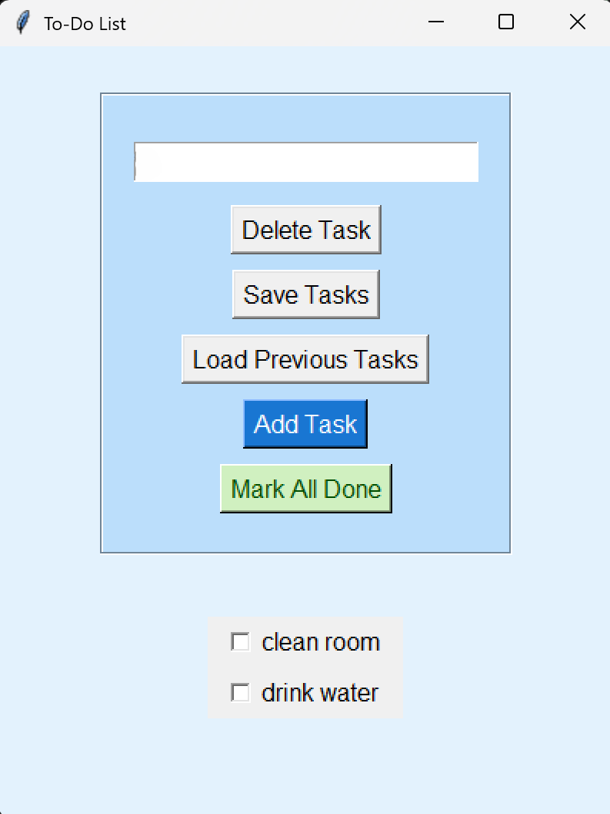

# To-Do List App

A simple and functional **To-Do List GUI Application** built with **Python** and **Tkinter**  
as part of my **#100DaysOfCode Challenge (Day 2)**.

---

## Features

- Buttons With keyboard bindings
- **Save** incomplete tasks to a `tasks.txt` file
- **Load** previous tasks on startup or by clicking the **"Load Previous Tasks"** button
- **Checkboxes** to mark tasks as completed
- **"Mark All Done"** button to check all tasks at once

---

## Screenshot

  

