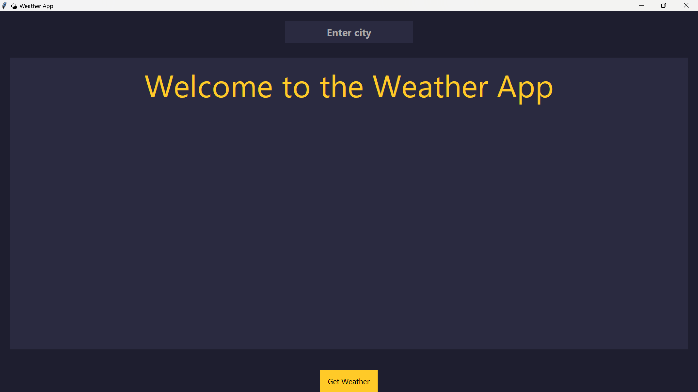

# 🌦️ Weather App – Day 3 of #100DaysOfCode

This is a **simple Weather Application** built using **Python**, **Tkinter**, and the **OpenWeatherMap API**. It allows users to get **real-time weather information** for any city.

---

## Features

-  Displays temperature in °C  
-  Shows wind speed in km/h  
-  Displays humidity percentage  
-  Weather condition description (e.g., "Cloudy", "Sunny")  
- ⚠️ Handles invalid or blank input gracefully  

---

## Screenshot

---

## Concepts Used

- **API Integration** using `requests`  
- **JSON parsing** to extract data  
- **Tkinter GUI** layout and styling  
- **Event binding** for keyboard input  
- **Modular Functions** for readability

---

