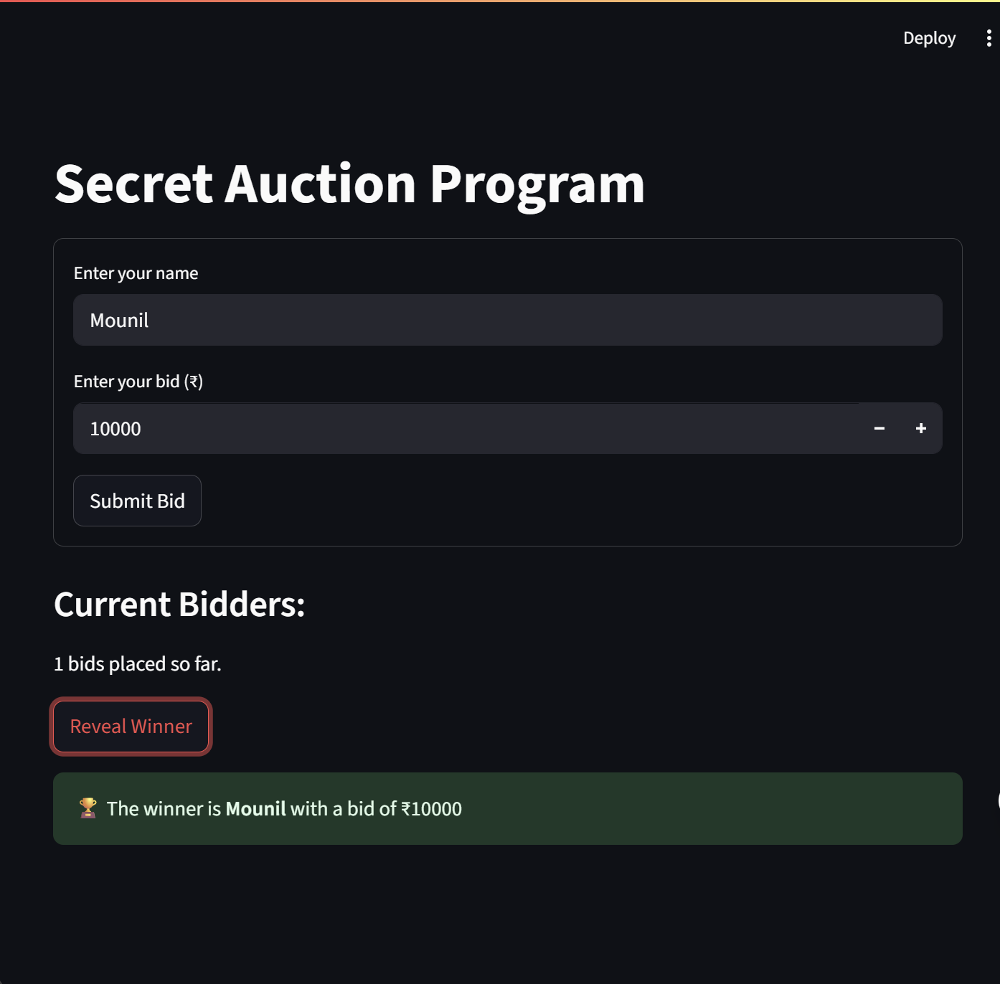

# 🕵️ Secret Auction App (Streamlit) – Day 33 of #100DaysOfCode

This project is a web-based **Secret Auction App** built using **Streamlit**. It allows multiple users to bid privately. The app collects bidders' names and their respective bids, and once all bids are submitted, it reveals the winner with the highest bid.

## 🚀 Features

- 💻 Web-based UI (runs in your browser)
- 👤 Multiple bidder support
- 🔒 Previous entries hidden to simulate secret bidding
- 🏆 Winner revealed based on the highest bid
- ✅ Easy and clean interface using Streamlit forms

---

## 📸 Screenshot

  

---

