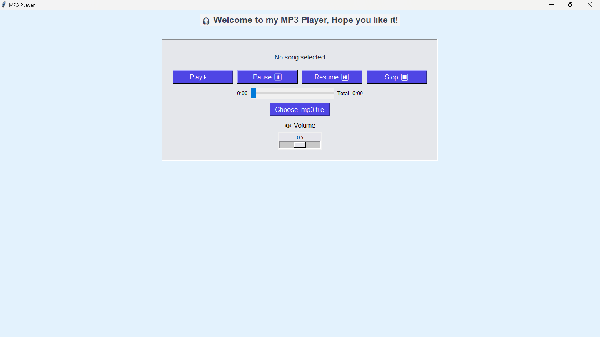

# 🎧 MP3 Music Player — Day 4 of #100DaysOfCode

This is a simple yet stylish MP3 Music Player built using **Python**, **Tkinter**, and **pygame** as part of my #100DaysOfCode challenge.

## Features

-  Play, Pause, Resume, and Stop functionality
-  Displays **current** and **total duration** of the song
-  Volume control slider
-  Dynamic progress bar that updates in real-time
-  Modern UI using `Tkinter` with custom styling and icons

## Tech Stack

- **Python**
- **Tkinter** — for GUI components
- **pygame** — for audio playback
- **mutagen** — for retrieving MP3 duration

## Screenshot

