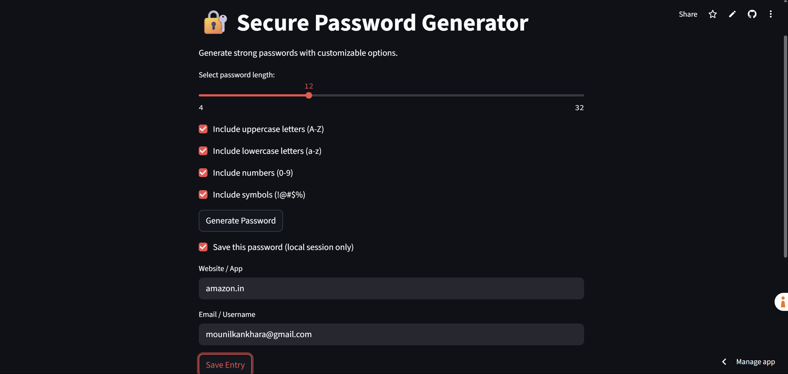
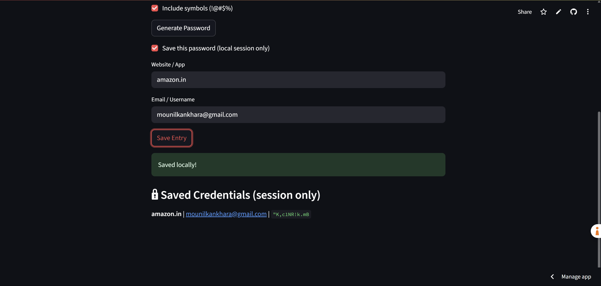

# 🔐 Password Generator Web App

A simple yet powerful **Password Generator & Session-Based Manager** built using **Python** and **Streamlit** as part of my #100DaysOfCode challenge (Day 5).

 <!-- Replace with actual path if different -->

---

## Features

- ✅ Generate strong, random passwords  
- ✅ Customize password length and include:
  - Uppercase letters
  - Lowercase letters
  - Numbers
  - Symbols  
- ✅ Save generated passwords (session-only for now)  
- ✅ Display and manage saved entries during session  
- ✅ Intuitive and minimal UI using Streamlit

---

## Technologies Used

- **Python 3**
- **Streamlit** – for creating the interactive UI
- `string`, `random` – for generating secure passwords

---

