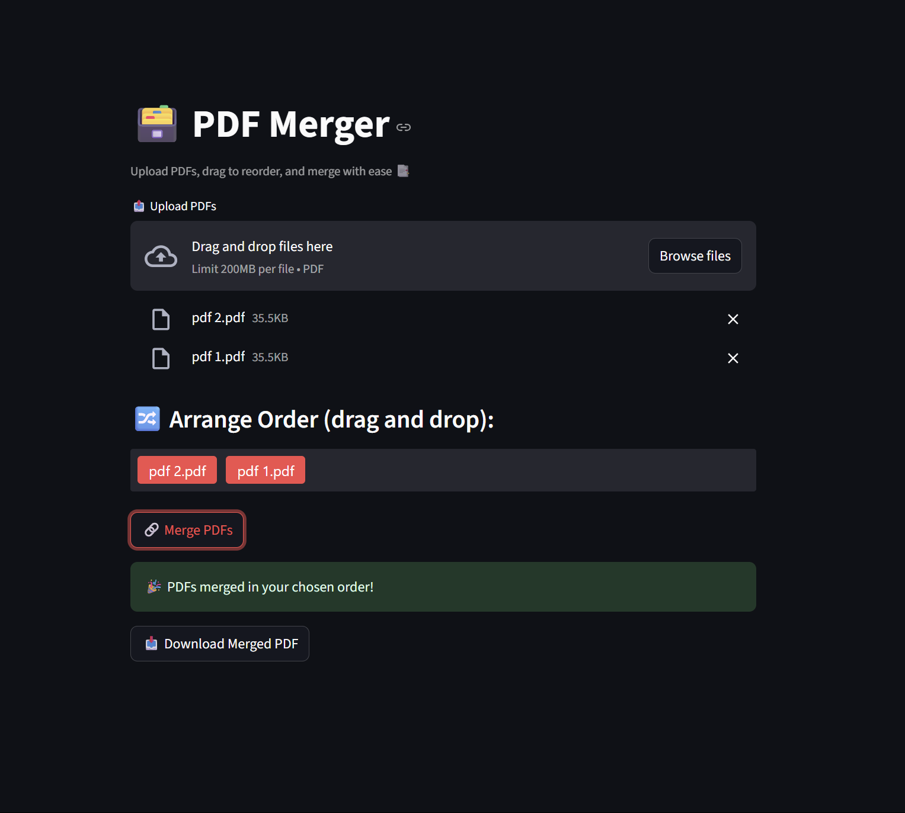

# 🗃️ Drag-and-Drop PDF Merger App

**Day 9 of #100DaysOfCode**

This is a modern and intuitive PDF merging tool built with **Streamlit**, enhanced by **drag-and-drop reordering** via `streamlit-sortables`. Upload, arrange, and merge PDFs — all in your browser. No storage, no fuss.

---

## 🚀 Features

- 📂 Upload multiple PDF files
- 🔀 Drag and reorder files before merging
- 🔗 Merge in your custom order
- 📥 Download the merged PDF instantly
- 🧠 All processing is done in memory

---

## 🛠️ Tech Stack

| Tool                | Purpose                         |
|---------------------|----------------------------------|
| Streamlit           | Web UI Framework                |
| PyPDF2              | Merge PDF files                 |
| streamlit-sortables | Drag-and-drop component         |
| io.BytesIO          | In-memory file processing       |

---

## 📸 Demo

